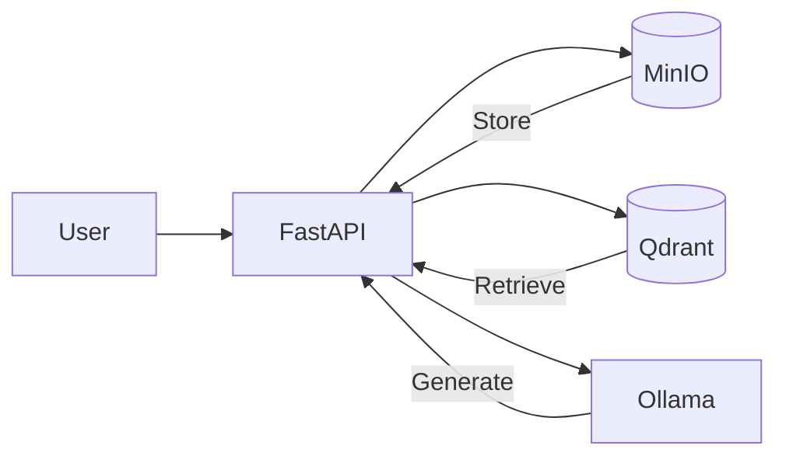

# 🇲🇦 Moroccan Legal AI Advisor
*A legal AI assistant powered by Retrieval-Augmented Generation*

## Features
- **Document Processing** - PDF/text extraction with precise chunking
- **Multilingual Support** - Arabic/French/English legal queries
- **Conversational Memory** - Context-aware follow-up questions
- **Secure Storage** - MinIO document management with access control
- **Blazing Fast Search** - Qdrant vector similarity search

# Backend

## Architecture


## Local Development Setup
```bash
# From backend folder
# Create virtual environment
python -m venv .venv
source .venv/bin/activate  # Linux/Mac
# .venv\Scripts\activate  # Windows

# Install dependencies
pip install -r requirements.txt

# Fill up .env file with appropriate values

# Run containers
docker-compose up -d

# Verify services
curl http://localhost:9000/minio/health/live  # MinIO
curl http://localhost:6333  # Qdrant

# Lanch application
uvicorn app.main:app --reload

```
